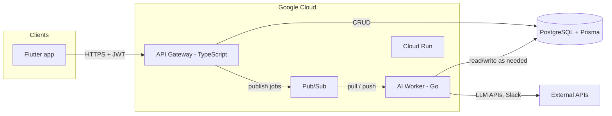

# MCAS Recipe System

Monorepo for an **MCAS-aligned** recipe database and shopping-list generator: fast CRUD and auth at the edge, asynchronous AI work off the request path, and a single PostgreSQL source of truth.

## Architecture overview

| Layer | Responsibility |
|--------|------------------|
| **Flutter** | Mobile/web UI, Riverpod/BLoC, secure token handling. |
| **TypeScript API** | Auth (Firebase/Auth0), JSON API, low-latency CRUD. |
| **Pub/Sub** | Decouples user-facing requests from slow AI pipelines. |
| **Go worker** | Subscribes to messages, calls LLMs, validates JSON with Go structs, side effects (e.g. Slack). |
| **PostgreSQL** | Schema and data; **Prisma** migrations and shared access from TS and Go. |

## TypeScript API gateway (Service 1)

The gateway is the **only** HTTP entry for the Flutter client under normal operation. It:

- Verifies **identity and authorization** on protected routes.
- Performs **synchronous CRUD** against PostgreSQL (via Prisma or your chosen data layer) for recipes, lists, and related entities.
- **Publishes** work items to **Google Cloud Pub/Sub** when the user triggers AI-heavy flows (e.g. recipe parsing, enrichment, shopping-list reasoning), instead of blocking the HTTP request on LLM latency.

That keeps p95 API times predictable and avoids tying connection pools and worker threads to unpredictable external AI calls.

## Go AI worker (Service 2)

The Go service is the **async AI plane**. It:

- **Subscribes** to Pub/Sub (push or pull, depending on how you wire Cloud Run).
- Performs **long-running or rate-limited** calls to LLM providers.
- **Parses and validates** model output with **strict Go structs** before persisting or notifying—reducing bad writes and making failures explicit.
- Sends **Slack** (or other) notifications for human review or ops signals when required.

Neither Flutter nor the TS gateway should call the LLM directly for heavy jobs; they enqueue work and read results from the DB or follow-up APIs as you define.

## Monorepo layout

This repository uses **pnpm** workspaces (`apps/*`, `packages/*`). Services (TS gateway, Go worker) and the Flutter app will live under `apps/` (or equivalent paths you adopt); shared TS packages under `packages/`.

## Deployment & CI (target)

- **Docker** multi-stage images for each service, deployed to **Google Cloud Run**.
- **GitHub Actions** with **Workload Identity Federation (OIDC)** for keyless deploys to GCP.

## Local development

Use each app’s own README or scripts once added (Prisma migrate, `pnpm` dev, `go run`, Flutter run). Keep secrets in `.env` files that stay **gitignored**; commit only `.env.example` templates with dummy values.
